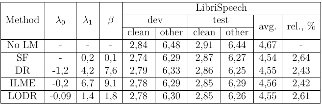

# LanguageModel_Fusion
 Realization of different LM integration methods for RNN-T. This project is inspired by the paper [[1]](https://arxiv.org/pdf/2203.16776.pdf) and implements the methods described in the mentioned article.

## Installation

All experiments were performed using Ubuntu OS.

- [Python](https://www.python.org/) We use Python 3.10.4 (main, Mar 23 2022, 23:05:40) [GCC 11.2.0] on linux

- [PyTorch](https://pytorch.org) is required: follow [their installation instructions](https://pytorch.org/get-started/locally/) before proceeding

- [NeMo](https://github.com/NVIDIA/NeMo). We use pre-trained RNN-T models.

- [huggingface/transformers](https://github.com/huggingface/transformers). We use pre-trained neural LM models.

- [kenlm](https://github.com/kpu/kenlm). Run the script 'setup.sh' (don't forget to use the command 'chmod +x setup.sh' before running) and follow instructions [kenlm in python](https://github.com/kpu/kenlm#python-module)

- in rest there is the file 'requirements.txt' there you can find all python libraries used for this project.

## Code from other sources

1. All scripts needed to train kenlm models can be found in the 'train_ngram' directory. This code is taken from [NeMo's kenlm scripts](https://github.com/NVIDIA/NeMo/tree/main/scripts/asr_language_modeling/ngram_lm) and was slightly changed for our purposes;
1. all scripts needed to train word-level neural LM can be found in the 'word_language_model' directory. This code is taken from [pytorch_examples](https://github.com/pytorch/examples/tree/main/word_language_model). The code was slightly changed for our purposes;
1. the code for WER computing was taken from [espnet](https://github.com/espnet/espnet).

In rest the code was created by the author.

## Data

All data used in this experiment for training and testing is taken from [LibriSpeech Dataset](https://huggingface.co/datasets/librispeech_asr).

You can find all models that were trained for this project at the link [Hugging Face](https://huggingface.co/AlexanderMaz/LanguageModel_Fusion).

## Basic usage

All experimental configurations are documented in `main.py`.

To implement rescoring for ASR models, a language model (LM) is pivotal, and its training procedure is outlined in the `train` method. The following specific training methods are defined:

- **`train_gpt2`:**
  - Fine-tunes the Transformer Neural LM, specifically the [GPT-2 LM model](https://huggingface.co/docs/transformers/model_doc/gpt2#transformers.GPT2LMHeadModel), utilizing the BPE tokenizer employed in the NeMo RNN-T model.

- **`train_lstm`:**
  - Trains a word-level LSTM Neural LM.

- **`train_ngram`:**
  - Training of an n-gram model, leveraging the BPE tokenizer used in the NeMo RNN-T model.

With the LM models now trained and fine-tuned, the subsequent steps involve the execution of rescoring. Noteworthy methods for this phase include:

- **`load_eval_data`:**
  - Responsible for loading all fine-tuned LM models as well as the validation and test datasets.

- **`optimize_hyperparams`:**
  - A method designed to identify optimal hyperparameters for rescoring using a dedicated validation dataset.

- **`rescore`:**
  - Executes the rescoring process with the trained and fine-tuned LM models.

## Experiments

We introduce auxiliary notations in order to formulate rescoring in probalistic-statistical language:

$X$ - acoustic features that come as input for a RNN-T neural network;

$Z$ - tensor which is the output of the RNN-T's last layer;

$Y_{RNN-T}$ - token sequence (tokens are taken from the tokenizer used in RNN-T) that corresonds to $X$;

$P_{RNN-T}(Y_{RNN-T}|X)$ - conditional probability which is calculated based on $Z$; it is basically the probability that given $X$ RNN-T generates $Y$ as output;

$Y_{ILM}$ - token sequence (obtained by the tokenizer used in ILM) that corresonds to $X$;

$P_{ILM}(Y_{ILM})$ - probability of $Y$ estimated by a separately trained simple neural LM or n-gram model over source domain transcripts. The idea is to modulate the probability assigned to $Y$ by Prediction Network which is built in RNN-T;

$Y_{ELM}$ - token sequence (obtained by the tokenizer used in ELM) that corresonds to $X$;

$P_{ELM}(Y_{ELM})$ - probability of $Y$ estimated by an external trained neural LM. LM should have a complex architecture;

$|Y_{RNN-T}|$ - lengths in tokens.

We use beam decoding algorithm to decode $Z$. The decoding algorithm gives us as a result $H$ - a set (list) of n-best hypotheses (first n most probalistic hypotheses) for each input audio frames. Thus we can use rescoring algorithm, i. e. to select from $H$ the best one $\bar{Y}$ using auxiliary algorithms and/or methods. We can convert $Y_{RNN-T}$ to words and after that obtain $Y_{ELM}$ and $Y_{ILM}$. If we formulate the latter idea mathematically we have

$\bar{Y}=\arg\max_{Y_{RNN-T}{\in}H}({\log}P_{RNN-T}(Y_{RNN-T}|X)+{\lambda_{0}}{\log}P_{ILM}(Y_{ILM})+{\lambda_{1}}P_{ELM}(Y_{ELM})+\beta(|Y_{RNN-T}|),$

where $\lambda_{0}$, $\lambda_{1}$, $\beta$ are hyper-parameters (real numbers). As a result we have

Table 1. Experiments on LibriSpeech

## References

Here are listed sources that are connected with RNN-T and LM fusion methods.

1. https://arxiv.org/pdf/2203.16776.pdf
1. https://arxiv.org/pdf/1807.10857.pdf
1. https://arxiv.org/pdf/2011.07754v1.pdf
1. https://arxiv.org/pdf/2104.04487.pdf
